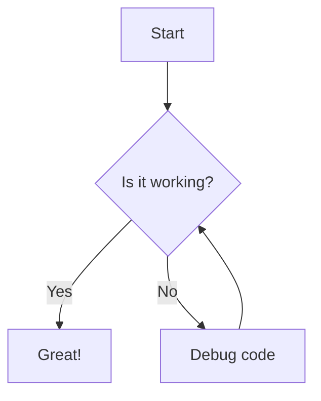

# Draw Diagrams With Markdown

You can plot a flow control graph or flowchart in Markdown using Mermaid syntax inside a fenced code block.  
[Draw-Diagrams](https://support.typora.io/Draw-Diagrams-With-Markdown/)

## Basic Flowchart Example

Use the **mermaid** identifier after three backticks,  
define your direction (like TD for top-down), and connect your nodes.

### Common Shape Syntax

+ Rectangle: A[Text]
+ Rounded Rectangle: A(Text)
+ Diamond (Decision): A{Text}
+ Stadium / Pill: A([Text])

### Flow Direction Options

+ **TD or TB**: Top-down
+ **LR**: Left to right
+ **BT**: Bottom-up
+ **RL**: Right to left
